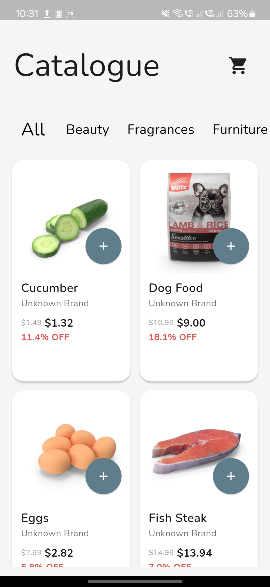
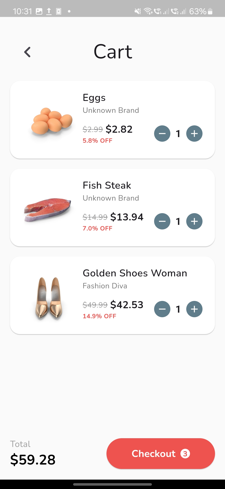

# **Catalogue App**

A Flutter-based catalogue app that displays a list of products, allows users to filter products by categories, and add items to a shopping cart. The app uses **BLoC** for state management, adheres to clean architecture principles, and ensures modularity for scalability.

---

## **Technologies and Frameworks**


---

## **Features**
- Display a paginated list of products fetched from an API.
- Filter products by categories.
- Add products to a shopping cart.
- Dynamic UI updates using BLoC for state management.
- Modern and intuitive UI/UX with Google Fonts.
- Error handling with **Dartz** for functional programming.

---

## **Getting Started**

Follow these instructions to set up and run the project locally.

### **Prerequisites**
- Flutter SDK: [Install Flutter](https://flutter.dev/docs/get-started/install)
- Dart: Ensure Dart is installed with Flutter.
- A text editor or IDE (e.g., VSCode, Android Studio).

### **Installation**
1. Clone the repository:
   ```bash
   git clone https://github.com/harshrajput1506/catalogue_flutter.git
   cd catalogue_flutter
   ```
2. Install dependencies:
   ```bash
   flutter pub get
   ```
3. Run the app:
   ```bash
   flutter run
   ```

---

## **Project Structure**

The project follows a feature-based folder structure:

```
lib/
├── core/                      # Core utilities and constants
├── data/
│   ├── repositories/          # Repositories for API interaction
├── domain/
│   ├── models/                # Domain models
│   ├── repositories/          # Repository interfaces
├── presentation/
│   ├── blocs/                 # BLoC files for state management
│   ├── screens/               # UI screens
│   ├── widgets/               # Reusable UI components
├── main.dart                  # App entry point
```

---

## **Key Technologies**
- **Flutter**: Framework for building cross-platform apps.
- **Dart**: Programming language for Flutter.
- **BLoC (Business Logic Component)**: State management.
- **Dartz**: Functional programming for error handling.
- **REST API**: Product and category data fetched from [DummyJSON API](https://dummyjson.com/products).
- **Google Fonts**: Modern typography.

---

## **Showcase**

### **Screenshots**
| Screenshot 1                            | Screenshot 2                            |
|-----------------------------------------|-----------------------------------------|
|  |  |

### **Demo Video**

<video src="screenshots/demo.mp4" controls="controls" style="max-width: 100%; height: auto;"> Your browser does not support the video tag. </video>

---

## **API Usage**
Products and categories are fetched from the [DummyJSON API](https://dummyjson.com/products).

- **Endpoint for Categories:**
  ```
  GET https://dummyjson.com/products/categories
  ```
- **Endpoint for Products:**
  ```
  GET https://dummyjson.com/products?limit=10&skip={offset}
  ```

---

## **How to Contribute**
1. Fork the repository.
2. Create a new branch:
   ```bash
   git checkout -b feature-branch
   ```
3. Commit your changes:
   ```bash
   git commit -m "Add your message"
   ```
4. Push the branch:
   ```bash
   git push origin feature-branch
   ```
5. Submit a pull request.

---

## **Future Enhancements**
- Implement user authentication.
- Save cart state persistently using a local database like SQLite.
- Enhance UI for better responsiveness on tablets.

---

## **License**

This project is licensed under the MIT License - see the [LICENSE](LICENSE) file for details.

---

## **Contact**

For any questions or feedback, contact me at:  
**Email:** [harshrajput2906@gmail.com](mailto:harshrajput2906@gmail.com)  
**GitHub:** [harshrajput1506](https://github.com/harshrajput1506)
